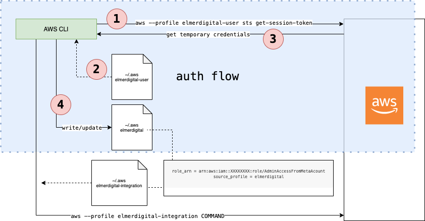

# AWS Authentication

AWS auth authenticates a user with temporary credentials for a specific amount of time with a MFA token

## Auth Flow



## Step 1 - add user specific AWS config & credentials 

~/.aws/config
``` 
[profile yourUserProfile]
region = eu-central-1

[profile subAccount]
region = eu-central-1
role_arn = arn:aws:iam::123456789:role/AdminAccessFromMetaAccount
source_profile = yourUserProfile
``` 

~/.aws/credentials
``` 
[yourUserProfile]
aws_access_key_id = 
aws_secret_access_key = 
aws_session_token = 
``` 

## Step 2 - authenticate

``` 
aws_auth <AWS_ACCOUNT_NAME> 

# example
aws_auth -v julian.kleinhans
``` 

Now you have to enter your MFA token. 
After that the script will add or update the `yourUserProfile` AWS profile in `~/.aws` 

## Step 4 - usage

Now you are able to talk with AWS via CLI. 
Example:

``` 
aws --profile yourUserProfile s3 ls
```

## AWS Role Switch in AWS Console
In order to easily switch roles in AWS console it is recommended to use a Browser Plugin "AWS Extend Switch Roles".
The following configuration can be used to configure this plugin:;

```
[yourUserProfile]
aws_account_id=123456789
role_name=AdminAccessFromMetaAccount
region=eu-central-1
color=b9acac
```
